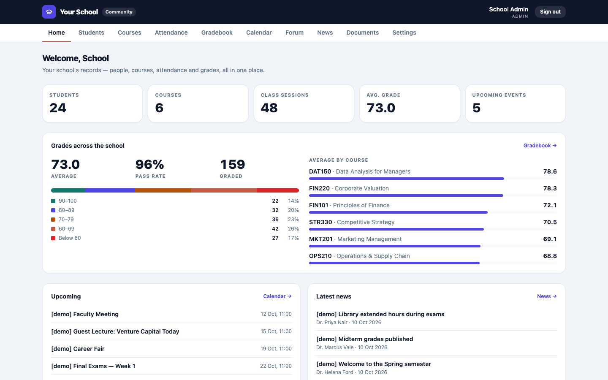
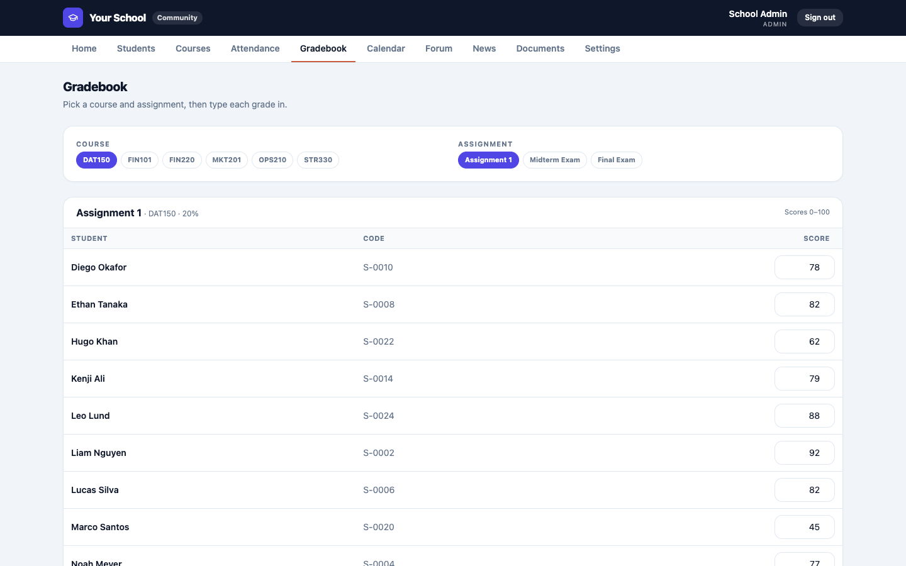
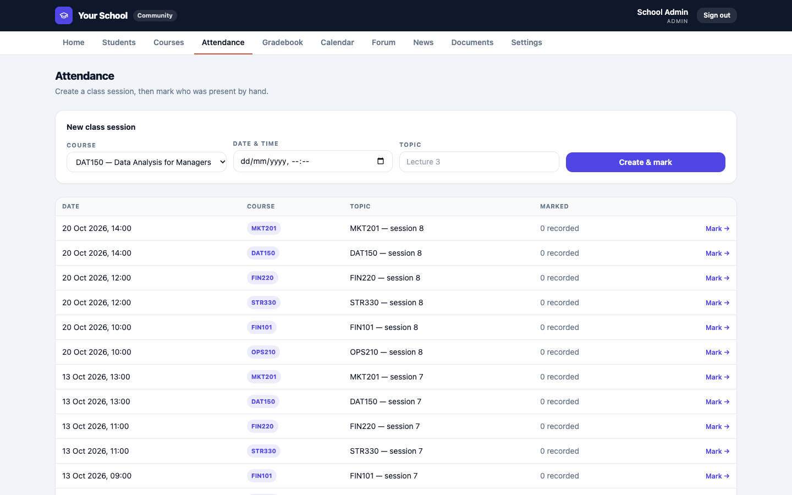
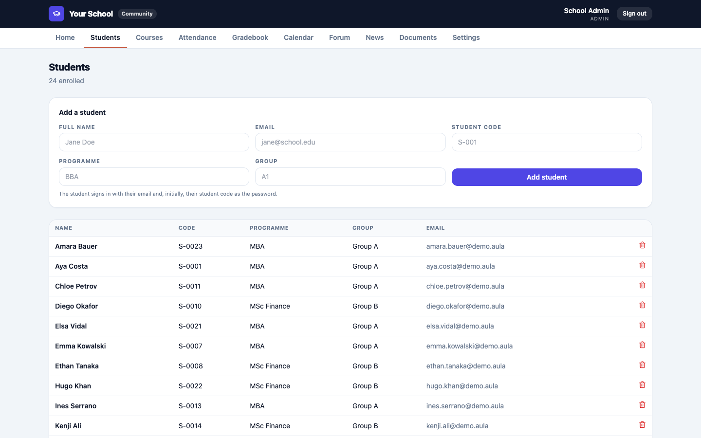

# Aula Magna — Community Edition

**The free, self-hosted system of record for your school.** Download it, run it on
your own server, and it's yours to keep — forever, at no cost. Your data never
leaves your machine.

> Community Edition is deliberately the *record-keeping* half of Aula Magna:
> people, courses, materials, **manual** attendance, a **basic** gradebook, a
> calendar, forum, news and documents. The time-saving automation — automatic
> QR/Zoom attendance, AI early-warning, careers, the mobile app, integrations,
> white-label and hands-off hosting — lives in the paid **Cloud** edition at
> [aulamagna.io](https://aulamagna.io).
>
> **There is no technical support for the Community Edition.** It's free and
> self-run. If you'd rather never touch a server, that's exactly what Cloud is for.



| Gradebook | Attendance | Students |
|---|---|---|
|  |  |  |

---

## What you need

- A machine you control (a small VPS, an office box, or your laptop) with either
  **Docker** *or* **Node.js 20+**.
- That's it. The database is a single SQLite file — no separate database server.

---

## Option A — Docker (recommended, one command)

```bash
# 1. get the code
git clone https://github.com/erkinefendiev/aula-magna-community.git && cd aula-magna-community

# 2. (recommended) set a real SESSION_SECRET + admin details
#    edit docker-compose.yml, or leave the defaults for a first look

# 3. run it
docker compose up -d

# 4. see your admin login
docker compose logs | grep -A5 "admin account"
```

Open **http://localhost:3080** and sign in. Put it behind a reverse proxy
(Caddy, Nginx, Cloudflare Tunnel) to serve it on your own domain over HTTPS.

Your entire school lives in the **`./data`** folder — **back it up by copying that
folder.** To update: `git pull && docker compose up -d --build`.

---

## Option B — Plain Node (no Docker)

```bash
git clone https://github.com/erkinefendiev/aula-magna-community.git && cd aula-magna-community
cp .env.example .env          # then edit SESSION_SECRET + admin details
npm install
npm run setup                 # creates the SQLite database + admin account
npm run build
npm run start                 # serves on http://localhost:3080
```

Want to look around first? `npm run db:seed:demo` fills the school with demo
students, courses, sessions and grades (every demo password is `demo`). It only
ever touches its own demo rows, so it is safe to run next to real data.

Keep it running with a process manager (`pm2`, `systemd`) and put a reverse proxy
in front for HTTPS + your domain.

---

## First steps after signing in

1. **Change the admin password** (create yourself a real account and remove the
   default one, or set a strong `ADMIN_PASSWORD` before first run).
2. **Settings → School name.**
3. **Students** → add your people (or one by one).
4. **Courses** → add courses, enrol students, attach materials.
5. **Attendance** → create a session, mark who's present.
6. **Gradebook** → enter grades per assignment.

Students sign in with their email and, initially, their student code as password.

---

## Backups

The whole school is one SQLite file. Back up by copying it:

- Docker: copy the **`./data`** folder.
- Node: copy the file at your `DATABASE_URL` (default `./data/community.db`).

Copy it while the app is stopped, or use `sqlite3 community.db ".backup backup.db"`.

---

## What's included vs Cloud

| | Community (free, self-host) | Cloud (subscription) |
|---|---|---|
| Student / staff records | ✅ | ✅ |
| Courses, modules & materials | ✅ | ✅ |
| Attendance | ✅ manual | ✅ automatic (QR + Zoom) |
| Gradebook | ✅ basic | ✅ + analytics |
| Calendar, forum, news, documents | ✅ | ✅ |
| AI early-warning / at-risk students | — | ✅ |
| Careers, mentoring, alumni | — | ✅ |
| Group messaging, Campus Coin | — | ✅ |
| Native apps (iOS + Android) | — | beta |
| Integrations (Zoom, LMS, webhooks) | — | ✅ |
| White-label / custom domain | — (Powered-by footer) | ✅ |
| Hosting, backups, updates, support | you run it | ✅ we run it |

**→ [Upgrade to Cloud](https://aulamagna.io)** whenever the manual work starts to
cost you more than the subscription saves.

---

## Tech

Next.js 15 · Prisma · SQLite · a single container. No external services required.

Not affiliated support — issues are self-diagnosed. The code is yours to read and
adapt.

## License

[MIT](LICENSE). Use it, change it, run it for your school.
